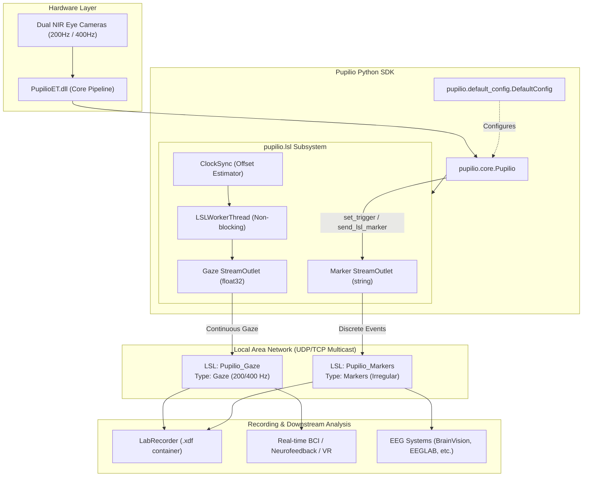

# LabStreamingLayer (LSL) Integration

Welcome to the **Pupilio LabStreamingLayer (LSL) Integration Guide**. This document provides an exhaustive, production-grade guide to broadcasting and synchronizing eye-tracking data with multi-modal research equipment (EEG, fNIRS, EMG, Motion Capture, etc.) using the Pupilio Python SDK.

---

## 1. Introduction & Multi-Modal Concept

**LabStreamingLayer (LSL)** is a system for the unified collection of measurement time series in research experiments that handles both networking, time-synchronization, and recording.

In multi-modal neuroscience and behavioral experiments (such as Brain-Computer Interfaces, visual evoked potential studies, or co-registered EEG-eye tracking), synchronizing data streams across different devices is critical.

Pupilio natively supports LSL streaming, providing:
- **Zero-Configuration Setup**: Turn on streaming with a single configuration flag (`enable_lsl = True`).
- **Dual-Stream Publishing**: Separates high-frequency continuous gaze data from discrete experimental events.
- **Hardware-Aligned Timestamps**: Sub-millisecond clock synchronization using the camera exposure clock, eliminating OS scheduling and network buffering jitter.
- **Trigger Forwarding**: Automatically synchronizes integer trigger codes and custom text annotations to the LSL network.
- **XDF Metadata Compliance**: Streams are described with full XML metadata detailing channel names, units, eye affiliations, and display geometry.

---

## 2. System Architecture



---

## 3. Channel Specifications & Stream Layout

Pupilio provides two user-selectable stream layouts configured via `config.lsl_stream_mode`:

### 3.1 Standard Mode: `standard` (12 Channels, Recommended)
Optimized for the vast majority of visual cognition, psychophysics, and EEG experiments:

| Channel # | Channel Label | Data Type | Units | Eye | Description |
| :---: | :--- | :---: | :---: | :---: | :--- |
| **0** | `bino_gaze_x` | `float32` | `pixels` | `both` | Binocular fused horizontal gaze point on screen (0 ~ 1920) |
| **1** | `bino_gaze_y` | `float32` | `pixels` | `both` | Binocular fused vertical gaze point on screen (0 ~ 1080) |
| **2** | `bino_valid` | `float32` | `binary` | `both` | Binocular gaze confidence (1: valid, 0: invalid / blink) |
| **3** | `left_gaze_x` | `float32` | `pixels` | `left` | Left eye horizontal gaze point on screen (0 ~ 1920) |
| **4** | `left_gaze_y` | `float32` | `pixels` | `left` | Left eye vertical gaze point on screen (0 ~ 1080) |
| **5** | `left_pupil_dia` | `float32` | `mm` | `left` | Left eye pupil diameter in millimeters (0 ~ 10 mm) |
| **6** | `left_valid` | `float32` | `binary` | `left` | Left eye gaze validity flag (1: valid, 0: invalid) |
| **7** | `right_gaze_x` | `float32` | `pixels` | `right` | Right eye horizontal gaze point on screen (0 ~ 1920) |
| **8** | `right_gaze_y` | `float32` | `pixels` | `right` | Right eye vertical gaze point on screen (0 ~ 1080) |
| **9** | `right_pupil_dia` | `float32` | `mm` | `right` | Right eye pupil diameter in millimeters (0 ~ 10 mm) |
| **10** | `right_valid` | `float32` | `binary` | `right` | Right eye gaze validity flag (1: valid, 0: invalid) |
| **11** | `trigger` | `float32` | `integer`| `none` | Active trigger code (0.0 when idle, $>0$ during trigger pulse) |

### 3.2 Research Mode: `full` (39 Channels)
Contains the full 38-parameter estimation output from the underlying deep neural network, followed by the trigger channel:
- **Left Eye (`0..13`)**: Gaze position `(x, y)`, pupil diameter, 3D pupil coordinate `(x, y, z)` in mm, visual angles spherical `(theta, phi)` in radians, visual direction vector `(x, y, z)`, resolution `(pix_per_degree_x, pix_per_degree_y)`, and validity.
- **Right Eye (`14..27`)**: Corresponding 14 parameters for the right eye.
- **Binocular Fused (`28..37`)**: `bino_gaze_x`, `bino_gaze_y`, `bino_valid`, and reserved estimation metrics.
- **Trigger Channel (`38`)**: `trigger` code.

### 3.3 Discrete Marker Stream (`Pupilio_Markers`)
- **Type**: `"Markers"`
- **Rate**: `0.0` (`pylsl.IRREGULAR_RATE`)
- **Format**: `pylsl.cf_string`
- **Payload**: Formatted event strings, including integer trigger codes (e.g. `"101"`, `"200"`) and semantic annotations (e.g. `"STIMULUS_ONSET"`, `"RESPONSE_KEY_SPACE"`).

---

## 4. Complete Code Examples

### 4.1 Pygame Experiment with Synchronized LSL Streaming

```python
import pygame
import os
from pupilio import Pupilio, DefaultConfig

# Initialize Pygame
pygame.init()
scn_width, scn_height = 1920, 1080
win = pygame.display.set_mode((scn_width, scn_height), pygame.FULLSCREEN | pygame.HWSURFACE)

# 1. Configure Pupilio with LSL
config = DefaultConfig()
config.enable_lsl = True
config.lsl_stream_mode = "standard"  # 12 channels
config.lsl_gaze_stream_name = "Pupilio_Gaze"
config.lsl_marker_stream_name = "Pupilio_Markers"

pupil_io = Pupilio(config=config)
pupil_io.create_session("pygame_lsl_study")

# 2. Calibration & Validation
pupil_io.calibration_draw(screen=win, validate=True)

# 3. Start Sampling (LSL background worker starts automatically)
pupil_io.start_sampling()

# Send trial start annotation
pupil_io.send_lsl_marker("TRIAL_01_START")

# Show fixation cross
win.fill((128, 128, 128))
pygame.draw.line(win, (255, 255, 255), (scn_width//2 - 20, scn_height//2), (scn_width//2 + 20, scn_height//2), 3)
pygame.draw.line(win, (255, 255, 255), (scn_width//2, scn_height//2 - 20), (scn_width//2, scn_height//2 + 20), 3)
pygame.display.flip()

# Send trigger code 10 (Fixation Onset)
pupil_io.set_trigger(10)
pygame.time.wait(1000)

# Present visual stimulus
win.fill((200, 200, 200))
pygame.draw.circle(win, (255, 0, 0), (scn_width//2, scn_height//2), 50)
pygame.display.flip()

# Send trigger code 20 (Stimulus Onset)
pupil_io.set_trigger(20)
pygame.time.wait(2000)

pupil_io.send_lsl_marker("TRIAL_01_END")

# 4. Stop Sampling (LSL stops automatically)
pupil_io.stop_sampling()

# Save local backup CSV
os.makedirs("./data", exist_ok=True)
pupil_io.save_data("./data/trial_01.csv")

# Clean up
pupil_io.release()
pygame.quit()
```

### 4.2 PsychoPy Experiment with LSL Integration

```python
from psychopy import visual, core, event
from pupilio import Pupilio, DefaultConfig

win = visual.Window(size=(1920, 1080), fullscr=True, units="pix", color=(0, 0, 0))

# Configure Pupilio
config = DefaultConfig()
config.enable_lsl = True
pupil_io = Pupilio(config=config)
pupil_io.create_session("psychopy_lsl_experiment")

# Calibrate
pupil_io.calibration_draw(screen=win, validate=True)

# Start LSL Recording
pupil_io.start_sampling()

fixation = visual.TextStim(win, text="+", height=40, color="white")
target = visual.GratingStim(win, tex="sin", mask="circle", size=200)

for trial in range(5):
    pupil_io.send_lsl_marker(f"TRIAL_{trial+1}_START")

    # Fixation
    fixation.draw()
    win.flip()
    pupil_io.set_trigger(1)
    core.wait(1.0)

    # Target
    target.draw()
    win.flip()
    pupil_io.set_trigger(2)
    
    # Wait for subject keypress
    keys = event.waitKeys(maxWait=2.0, keyList=["space", "escape"])
    if keys:
        pupil_io.set_trigger(99)  # Response trigger
        pupil_io.send_lsl_marker(f"RESPONSE_{keys[0].upper()}")

    pupil_io.send_lsl_marker(f"TRIAL_{trial+1}_END")
    core.wait(0.5)

pupil_io.stop_sampling()
pupil_io.save_data("./psychopy_gaze.csv")
pupil_io.release()
win.close()
core.quit()
```

### 4.3 Real-Time LSL Receiver and Data Inspector

Use this script to monitor and verify incoming Pupilio streams from another computer or process on the network:

```python
import pylsl
import time

print("Resolving Pupilio LSL streams...")
gaze_streams = pylsl.resolve_byprop("name", "Pupilio_Gaze", timeout=5.0)
marker_streams = pylsl.resolve_byprop("name", "Pupilio_Markers", timeout=2.0)

if not gaze_streams:
    print("Could not find Pupilio_Gaze stream!")
    exit(1)

gaze_inlet = pylsl.StreamInlet(gaze_streams[0])
marker_inlet = pylsl.StreamInlet(marker_streams[0]) if marker_streams else None

print("Connected! Streaming live gaze data:")
try:
    while True:
        # Pull 12-channel gaze sample
        sample, ts = gaze_inlet.pull_sample(timeout=0.05)
        if sample:
            bino_x, bino_y, b_valid = sample[0], sample[1], sample[2]
            l_pupil = sample[5]
            r_pupil = sample[9]
            trig = int(sample[11])
            print(f"[{ts:.3f}] Gaze: ({bino_x:.1f}, {bino_y:.1f}) | Pupil: L={l_pupil:.2f}mm, R={r_pupil:.2f}mm | Trig={trig}")

        # Check for discrete markers
        if marker_inlet:
            m_sample, m_ts = marker_inlet.pull_sample(timeout=0.0)
            if m_sample:
                print(f"\n>>> [MARKER @ {m_ts:.3f}] {m_sample[0]} <<<\n")
except KeyboardInterrupt:
    print("\nExiting...")
```

---

## 5. LabRecorder Recording Workflow

To record synchronized data across Pupilio and your EEG/fNIRS devices:

1. **Install LabRecorder**: Download the latest release from the [LabRecorder GitHub Releases](https://github.com/labstreaminglayer/App-LabRecorder/releases).
2. **Start Your Data Sources**:
   - Start your EEG amplifier acquisition software (e.g. BrainVision RDA, BioSemi ActiView, OpenBCI GUI).
   - Start your Pupilio script (`enable_lsl = True`).
3. **Launch LabRecorder**:
   - Click the **Update** button.
   - LabRecorder will discover all active streams on the network.
   - Check the boxes next to:
     - `Pupilio_Gaze (Gaze)`
     - `Pupilio_Markers (Markers)`
     - Your EEG data stream (e.g. `BrainVision RDA (EEG)`)
     - (Optional) Audio / Video / Keyboard streams
4. **Configure File Storage**:
   - Set the participant ID, session number, and output `.xdf` file destination.
5. **Start Recording**:
   - Click **Start**. The recording indicators will turn green.
   - Execute your experimental task.
   - Click **Stop** when finished.

---

## 6. Post-Processing & Downstream Analysis

### 6.1 Loading XDF in Python (`pyxdf`)

```python
import pyxdf
import numpy as np
import matplotlib.pyplot as plt

data, header = pyxdf.load_xdf("sub-01_task-vissearch.xdf")

gaze_stream = None
marker_stream = None
eeg_stream = None

for s in data:
    stream_name = s["info"]["name"][0]
    if stream_name == "Pupilio_Gaze":
        gaze_stream = s
    elif stream_name == "Pupilio_Markers":
        marker_stream = s
    elif s["info"]["type"][0] == "EEG":
        eeg_stream = s

# Inspect Gaze Data
gaze_time = np.array(gaze_stream["time_stamps"])
gaze_samples = np.array(gaze_stream["time_series"])

# Channel mapping:
bino_x = gaze_samples[:, 0]
bino_y = gaze_samples[:, 1]
left_pupil = gaze_samples[:, 5]
right_pupil = gaze_samples[:, 9]
triggers = gaze_samples[:, 11]

# Inspect Markers
marker_time = np.array(marker_stream["time_stamps"])
marker_labels = [m[0] for m in marker_stream["time_series"]]

print(f"Loaded {len(gaze_time)} gaze samples.")
print(f"Loaded {len(marker_labels)} event markers: {marker_labels[:5]}...")
```

### 6.2 Analysis in MNE-Python

```python
import mne
import numpy as np

# Convert Pupilio Gaze data into an MNE RawArray
ch_names = [
    "bino_x", "bino_y", "bino_valid",
    "left_x", "left_y", "left_pupil", "left_valid",
    "right_x", "right_y", "right_pupil", "right_valid",
    "STI" # Trigger channel for MNE
]
ch_types = ["eyegaze", "eyegaze", "misc", "eyegaze", "eyegaze", "pupil", "misc", "eyegaze", "eyegaze", "pupil", "misc", "stim"]

sfreq = float(gaze_stream["info"]["nominal_srate"][0])
info = mne.create_info(ch_names=ch_names, sfreq=sfreq, ch_types=ch_types)

# MNE expects shape (n_channels, n_times)
raw_gaze = mne.io.RawArray(gaze_samples.T, info)
print(raw_gaze)
```

### 6.3 EEGLAB Integration (MATLAB)

1. In EEGLAB, install the `xdf2eeglab` plugin from the EEGLAB Extension Manager.
2. Go to **File -> Import data -> Using EEGLAB functions and plugins -> From XDF file**.
3. Select your `.xdf` file. EEGLAB will import both EEG and Pupilio Gaze channels onto the same synchronized timeline and automatically convert LSL markers into EEGLAB `EEG.event` structures.

---

## 7. Troubleshooting & FAQs

### Q1: LabRecorder does not discover `Pupilio_Gaze` or `Pupilio_Markers`
- **Cause**: Windows Firewall blocking UDP multicast packets, or multiple network adapters (e.g. Wi-Fi + VPN + Ethernet).
- **Solution**:
  1. Open Windows Firewall Settings and ensure Python (or your IDE) is allowed for both Private and Public networks.
  2. If using multiple network adapters, specify the binding interface in your LSL configuration file (`lsl_api.cfg`).

### Q2: How does Pupilio ensure sub-millisecond synchronization?
- Pupilio uses a continuous clock synchronization algorithm. Rather than recording the timestamp when the network packet is sent, Pupilio captures the exact camera exposure hardware time ($t_{\text{cam}}$) and offsets it against `pylsl.local_clock()`. This completely bypasses Python GIL delays and Windows thread scheduling jitter.

### Q3: Can I run multiple Pupilio eye trackers on the same network?
- **Yes**. Give each eye tracker unique stream names via configuration:
  ```python
  config.lsl_gaze_stream_name = "Pupilio_SubjectA_Gaze"
  config.lsl_marker_stream_name = "Pupilio_SubjectA_Markers"
  ```
